# Chapter 1: ESN prediction and control of Hindmarsh–Rose dynamics

This repository contains the complete computational workflow and curated evidence for Chapter 1 of a master's thesis. It studies whether an Echo State Network (ESN) can learn periodic-spiking, periodic-bursting, and chaotic-bursting Hindmarsh–Rose dynamics, and whether the trained chaotic-bursting ESN can be controlled using linear feedback, global finite-time feedback, and Pyragas delayed feedback.

The controllers act on the trained ESN digital twin. They do not directly control a biological neuron or the original differential equations.

## Chapter 1 workflow

```mermaid
flowchart LR
    A[Simulate three Hindmarsh–Rose regimes] --> B[Training and model-selection data]
    B --> C[Compare GP, random, random-forest, and GBRT search]
    C --> D[Lock the selected ESN]
    D --> E[Evaluate once on held-out test data]
    E --> F[Reuse chaotic-bursting ESN for control]
    F --> G[Select controller parameters on validation segment]
    G --> H[Evaluate locked controllers on test segment]
    H --> I[Repeat locked workflow across five reservoir seeds]
```



1. **Generate the dynamical regimes.** `data_loader.py` simulates periodic spiking, periodic bursting, and chaotic bursting with fixed Hindmarsh–Rose parameter sets.
2. **Separate model selection from final testing.** Seventy percent of each trajectory is available for training and recursive validation. The remaining thirty percent is held out and is not used by Bayesian optimization.
3. **Compare optimizers.** Gaussian-process, random, random-forest, and GBRT searches are evaluated on three non-overlapping recursive validation windows.
4. **Lock and test the ESN.** The selected hyperparameters are trained once and evaluated on the held-out trajectory.
5. **Select and test controllers.** Linear, finite-time, and Pyragas parameters are selected on a controller-validation segment. Each locked controller is evaluated once on a separate controller-test segment.
6. **Evaluate seed robustness.** The selected ESN and controller parameters are fixed while only the reservoir seed changes across `42`, `123`, `456`, `789`, and `2026`.

## Repository layout

| Path | Purpose |
|---|---|
| `main.py` | Command-line entry point for individual prediction and control experiments |
| `final_pipeline.py` | Complete Chapter 1 workflow |
| `model.py` | Echo State Network implementation |
| `optimize_model.py` | Hyperparameter search, recursive validation, and scoring |
| `control_experiment.py` | Controller parameter selection and held-out evaluation |
| `neuron_controllers.py` | Linear, finite-time, and Pyragas control laws |
| `plotting.py` | Prediction, optimization, and control plotting utilities |
| `multiseed_evaluation.py` | One-seed locked-configuration robustness evaluation |
| `aggregate_multiseed_results.py` | Five-seed aggregation and representative-seed selection |
| `scripts/thesis_figures/` | Standalone thesis figure-generation scripts |
| `tests/` | Unit, methodology, CLI-contract, and reduced pipeline tests |
| `FINAL_THESIS_RUN/` | Validated Chapter 1 evidence package |
| `MULTISEED_EVAL/` | Compact five-seed metrics and aggregate results |
| `THESIS_SWEEP_FIGURES/` | Thesis-ready controller validation-sweep figures and source data |
| `Figures/` | Additional thesis comparison figures |

## Installation

The definitive workflow used Python 3.12. Create a local environment with:

```bash
python3 -m venv .venv
source .venv/bin/activate
python -m pip install --upgrade pip
python -m pip install -r requirements.txt
```

On the HPC system, activate the established environment with:

```bash
module load python/3.12-conda
source "$(conda info --base)/etc/profile.d/conda.sh"
conda activate "$HOME/.conda/envs/thesis_final"
export PYTHONNOUSERSITE=1
export CONDA_PKGS_DIRS="$HOME/.conda/pkgs"
```

## Running Chapter 1

Inspect the general command-line interface:

```bash
python main.py --help
```

Submit the complete validated workflow:

```bash
sbatch run_final_thesis_pipeline.slurm
```

The Slurm workflow requires a clean committed tree. Raw HPC evidence uses a job-specific external path to prevent collisions. The curated repository copy uses the stable name `FINAL_THESIS_RUN/`.

A definitive run is accepted only when `00_manifest/final_package_validation.json` reports `"valid": true`.

## Running the five-seed evaluation

Submit the five reservoir seeds as a Slurm array:

```bash
sbatch run_multiseed_evaluation.slurm
```

After every task completes, aggregate the shared result directory:

```bash
python aggregate_multiseed_results.py \
  --output-root "$HOME/Thesis_evidence_20260624/MULTISEED_EVAL_<ARRAY_JOB_ID>"
```

The repository keeps compact CSV, JSON, Markdown, and per-seed metric evidence in `MULTISEED_EVAL/`. Large rollout CSV and NPZ files are reproducible and remain in external HPC evidence storage rather than Git.

## Main results

### Held-out ESN prediction from the definitive run

| Regime | Selected optimizer | x NRMSE | All-state NRMSE |
|---|---:|---:|---:|
| Periodic spiking | Random forest | 0.0000726 | 0.0000445 |
| Periodic bursting | Random forest | 0.04037 | 0.02754 |
| Chaotic bursting | GBRT | 0.002275 | 0.001528 |

### Controller test results from the definitive run

| Controller | Locked parameters | Controller-test result |
|---|---|---|
| Linear feedback | `K = 1.005` | State RMSE `2.36e-06`; 100% spike reduction |
| Global finite-time feedback | `s = 0.9`, `K = 0.914456` | State RMSE `2.50e-04`; 100% spike reduction |
| Pyragas delayed feedback | Delay `1600`, sign `-1`, `K = 0.768091` | Recurrence error `0.01343`; correlation `0.99991` |

Linear and finite-time feedback regulate toward an empirical quiet-state reference derived from training data. Pyragas control has a different objective: it transforms irregular bursting into a regular periodic-spiking trajectory.

### Five-seed robustness

| Quantity | Result across five seeds |
|---|---:|
| Held-out prediction x NRMSE | `0.002295 ± 0.000891` |
| Held-out all-state NRMSE | `0.001545 ± 0.000600` |
| Linear feedback success | `5/5` |
| Global finite-time feedback success | `5/5` |
| Pyragas delayed-feedback success | `5/5` |
| Representative seed | `42` |

Detailed aggregate tables are in `MULTISEED_EVAL/multiseed_summary.md` and the accompanying CSV and JSON files.

## Thesis figures

Generate or regenerate figures from the repository root, for example:

```bash
python scripts/thesis_figures/create_chaotic_bursting_figure.py
python scripts/thesis_figures/create_periodic_bursting_figure.py
python scripts/thesis_figures/create_periodic_spiking_figure.py
python scripts/thesis_figures/create_linear_finite_comparison.py
python scripts/thesis_figures/create_finite_time_sensitivity_attractive.py
python scripts/thesis_figures/regenerate_optimizer_plots.py
```

The scripts resolve the repository root automatically. Controller validation-sweep figures document parameter selection; they must not be described as held-out controller-test results.

## Validation

Run the automated checks with:

```bash
PYTHONPATH="$PWD" python -m pytest -q
bash -n run_final_thesis_pipeline.slurm
bash -n run_multiseed_evaluation.slurm
jq ".valid" FINAL_THESIS_RUN/00_manifest/final_package_validation.json
```

The final package stores source hashes, configuration, software versions, random seeds, commands, stage timings, integrity hashes, and validation status under `FINAL_THESIS_RUN/00_manifest/`.

## Reproducibility boundaries

- The definitive evidence package was produced from commit `2e953b065b3208c1556cf3d56ce690a1f7cd48c5` and passed its package validator.
- The multiseed experiment changes only the reservoir seed; data, split boundaries, ESN hyperparameters, normalization, washout, and controller parameters remain locked.
- The regularized readout solve can emit an ill-conditioned-matrix warning. The implementation checks finite outputs and includes a pseudoinverse fallback.
- The Pyragas result is empirical and finite-horizon. It demonstrates a sustained regular trajectory in the tested ESN rollout, not a proof of asymptotic stability.
